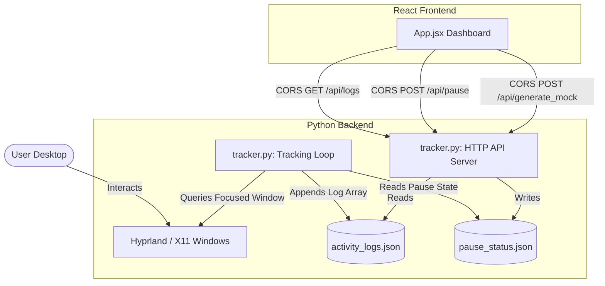

# Proof of Concept: Automated Desktop Activity Tracking (TrackFlow)

This document presents the detailed implementation report for the **TrackFlow Proof of Concept (PoC)**, an automated desktop activity logger and tracker. It lists the architecture, design choices, native platform adjustments (especially for Wayland & Hyprland), and how to verify the entire system.

---

## 1. Executive Summary
TrackFlow eliminates the heavy burden of manual timesheet and work logging by tracking desktop application usage automatically. It records active windows locally, securely, and privately in a structured JSON format. Users simply review and approve their daily summary from a sleek local dashboard.

### Core Objectives Achieved:
*   **Zero-Effort Background Logging**: Runs a Python script to track window focus without user intervention.
*   **Local Privacy First**: Uses raw JSON files (`activity_logs.json`) stored strictly on the user's local disk. No cloud databases required.
*   **Native Hyprland/Wayland Support**: Detects Wayland compositor structures and dynamically utilizes compositor-native queries (`hyprctl`) to bypass Wayland's strict window-sandbox security rules.
*   **Visual-First Dashboard**: Implemented via React + Tailwind CSS v4 and Recharts. Includes statistical metrics, focus timelines, and application usage distributions.
*   **Interactive Simulation Mode**: Implemented a "Generate Demo Logs" button to populate sample logs instantly for rapid testing.

---

## 2. System Architecture



---

## 3. Component Details

### A. Background Activity Tracker (`tracker/tracker.py`)
Runs two concurrent operations:
1.  **A Daemon Tracking Thread**: Polls active windows every 2 seconds. Calculates exact active durations by noting when focused window titles switch.
    *   **OS Check**: Inspects OS (Windows vs. Linux vs. MacOS).
    *   **Compositor Detection**: Checks if `hyprctl` is available (indicating the active user is running on **Hyprland** under Wayland).
    *   **Security Bypass**: Safely issues Wayland-safe compositor-level JSON requests to get current focused window details:
        ```bash
        hyprctl activewindow -j
        ```
    *   **X11 Fallback**: Falls back to `xprop` if on standard Xorg setups.
2.  **A Local API HTTP Server**: Runs on port `5001`. Provides simple JSON routes for the React frontend:
    *   `GET /api/logs` — Reads and outputs entire log array.
    *   `GET /api/status` — Returns if tracking is active or paused.
    *   `POST /api/pause` — Disables or enables logging.
    *   `POST /api/generate_mock` — Overwrites log file with rich mock data for testing.

### B. React Visualization Dashboard (`frontend/src/App.jsx`)
A modern, dark-mode focused application built with:
*   **Tailwind CSS v4**: Beautiful gradients, premium cards, hover micro-interactions.
*   **Recharts**: Custom Bar and Donut Pie charts.
*   **Navigation Tabs**: 
    1.  *Analytics Dashboard*: Displays key stats, focus hours bar chart, and application share.
    2.  *Review Logs*: Displays a detailed log validation table for manual timesheet check-off.
*   **On-Demand Demo Generator**: Prompts the user to generate rich developer logs (featuring VS Code, Google Chrome watching cricket streams, and YouTube playlists) if no real logs exist yet.

---

## 4. Technical File Structure

```
Activity_Tracker/
├── README.md                 # Project execution guide
├── test_xprop.py             # Scratch troubleshooting script
├── tracker/
│   ├── tracker.py            # Main Python tracking & HTTP API daemon
│   ├── requirements.txt      # Python system dependencies
│   ├── activity_logs.json    # Local logs database (JSON format)
│   └── pause_status.json     # Tracking state (JSON format)
└── frontend/
    ├── package.json          # Node dependencies
    ├── vite.config.js        # Vite & Tailwind V4 compiler options
    ├── src/
    │   ├── main.jsx          # React initialization mount
    │   ├── App.jsx           # Core Dashboard layout & network logic
    │   └── index.css         # Tailwind V4 import and styling config
    └── public/               # Static assets
```

---

## 5. Verification & Setup Instructions

### Step 1: Run the Backend Tracker
```bash
cd tracker
python3 -m venv venv
source venv/bin/activate
pip install -r requirements.txt
python tracker.py
```
*Console output should state: `Starting background activity tracker... Starting local API server on port 5001...`*

### Step 2: Run the UI Development Server
```bash
cd frontend
npm install
npm run dev
```
*Console output should print the server address: `http://localhost:5173/`*

### Step 3: Interactive Visual Validation
1.  Open **[http://localhost:5173/](http://localhost:5173/)** in your browser.
2.  If it is your first launch in a terminal session, click the **"Generate Realistic Demo Logs"** button to load the custom cricket and developer log suite.
3.  Toggle the **Pause Tracking** button to see the tracker status seamlessly update in real-time.
4.  Focus on another window (like VS Code or another Chrome tab) for more than 3 seconds to watch the system dynamically detect and record your real activity.
